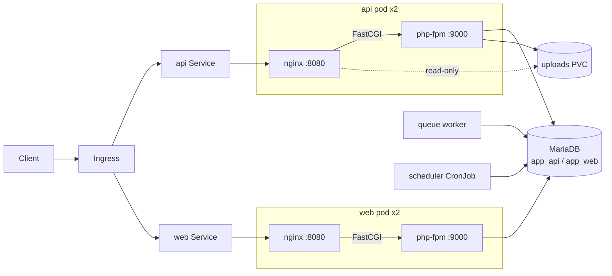

# Laravel on Kubernetes


A proof of concept for moving a **VM-based Laravel estate** (Nginx + PHP-FPM, cron, supervisord, uploads on local disk) onto Kubernetes **without rewriting the app**.

It uses a stock Laravel app as the example, but the chart is shaped by the constraints of a real legacy PHP platform: two apps sharing one database server, user uploads on disk, queue workers, a crontab, and releases that must not drop requests.

---

## 🧭 From VM to pod

| On the VMs | Here | Why |
|---|---|---|
| Nginx + PHP-FPM on one host | **Nginx sidecar** in the FPM pod, FastCGI on `127.0.0.1:9000` | Same request path the app was built for; no network hop to FPM |
| Code and assets deployed onto the disk | **Two images from one Dockerfile**: `fpm` has the code, `web` has only `public/` | Immutable releases; OPcache never re-checks files |
| One FPM pool sized for the whole box | `pm.max_children` **per app** from Helm values | A heavy app (or a vulnerability scanner hammering it) can't starve the other one |
| `php artisan migrate` run by hand after deploy | **Helm `pre-install` / `pre-upgrade` hook Job** | New code never meets an old schema; a failed migration stops the release and old pods keep serving |
| `supervisord` running `queue:work` | **Worker Deployment**, `pcntl` built in | Stops cleanly on SIGTERM; scale with `replicas` |
| Server crontab `* * * * * schedule:run` | **CronJob**, `concurrencyPolicy: Forbid` | Runs once per minute cluster-wide, never overlapping |
| Uploads in `storage/app/public` on local disk | **PVC** mounted read-write in FPM, read-only in Nginx at `public/storage` | Keeps the `storage:link` layout the app expects; switch to RWX (EFS/NFS) for multi-node |
| `.env` file on the server | **Kubernetes Secret** + plain env from values | Secrets never baked into the image |
| Deploys with a few seconds of 502s | `maxUnavailable: 0`, readiness through Nginx → FPM → Laravel, **graceful `preStop`** on both containers | Pods leave the load balancer before FPM and Nginx quit |

---

## 🏗️ Layout



```
app/                  Dockerfile (fpm + web targets), nginx/FPM/PHP config, demo route
charts/laravel-app/   the Helm chart, installed once per app
values/               api.yaml (worker + scheduler), web.yaml (HTTP only)
deploy/dev/           MariaDB + Mailpit for local only
scripts/              deploy, smoke test, zero-downtime check
```

---

## 🚀 Run it locally

Needs Docker, [k3d](https://k3d.io), kubectl and Helm.

```bash
make up        # k3d cluster, build + import images, deploy MariaDB, Mailpit, api and web
make smoke     # both apps answer and can reach the database

curl http://api.localtest.me/
# {"app":"api","pod":"api-laravel-app-7c9d...","php":"8.3.x","database":"ok"}

make down
```

`*.localtest.me` resolves to `127.0.0.1`, so there's no `/etc/hosts` editing.

To see a zero-downtime rollout yourself:

```bash
./scripts/zero-downtime.sh
# requests ok=1142 failed=0
```

---

## ⚙️ Chart values that matter

| Value | Default | What it does |
|---|---|---|
| `fpm.maxChildren` | `10` | FPM pool size for this app |
| `existingSecret` | `""` | Secret with `APP_KEY`, `DB_*` (the chart can create one for demos) |
| `uploads.accessMode` | `ReadWriteOnce` | Set `ReadWriteMany` when pods spread across nodes |
| `worker.enabled` / `scheduler.enabled` | `false` | Turn on for the app that owns queues and scheduled jobs |
| `migrations.enabled` | `true` | Run `migrate --force` as a pre-install/pre-upgrade hook |
| `autoscaling.enabled` | `false` | HPA on CPU (then `replicas` is ignored) |

---

## 🔜 Not done yet

- Argo CD instead of `helm upgrade` from a script
- External Secrets Operator instead of creating Secrets by hand
- Metrics: php-fpm exporter + nginx exporter, scraped by Prometheus
- A real managed database and RWX storage in a cloud cluster

---

## 🤖 AI usage

The design, the constraints and the VM-to-Kubernetes mapping come from my own work migrating a legacy PHP platform. I used an AI assistant (Claude) to write this public version from scratch with a stock Laravel app, and to draft the README. I've reviewed all of it and can explain every choice.
